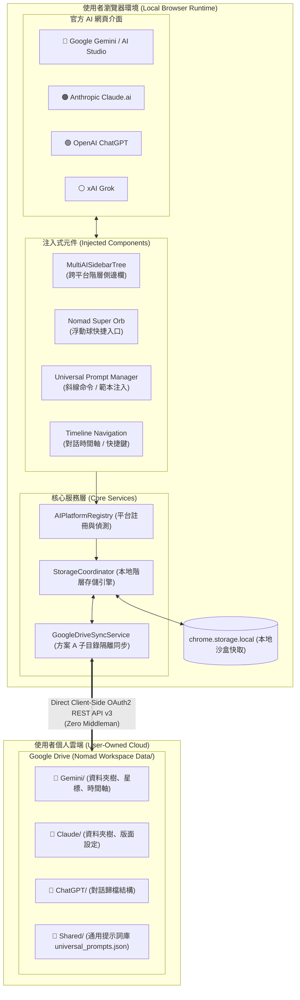

<p align="right">
  <b>繁體中文</b> | <a href="README_EN.md">English</a>
</p>

# 🧭 Nomad AI Workspace

> **全方位跨 AI 平台工作空間 (All-in-One Multi-AI Workspace Browser Extension)**  
> 專為 Google Gemini、Anthropic Claude、OpenAI ChatGPT 與 xAI Grok 打造的本地優先 (Local-First)、零信任 (Zero-Trust) 瀏覽器增強套件。在各官方 AI 側邊欄注入跨平台階層樹狀圖，並由個人 Google Drive 實體子目錄安全隔離存放。

[](LICENSE)
[](CHANGELOG.md)
[](#-支援平台矩陣-supported-platforms)
[](https://github.com/boboidvtw/nomad-ai-workspace)
[](https://www.paypal.me/boboidvtw)

---

## 📖 關於本專案 (About)

在日常研發與知識工作中，專業開發者與研究人員經常需要在多個頂尖 AI 平台之間穿梭——用 **Claude** 進行複雜編程、代碼審計與 Artifacts 架構推演，用 **Gemini** 進行超長上下文分析與多模態研究，並利用 **ChatGPT** 或 **Grok** 探索最新前沿推理與社群即時脈動。

然而，現有的多 AI 工作流面臨兩大核心痛點：

1. **資料孤島與碎片化**：每個 AI 平台的對話分類、資料夾與提示詞各自割裂，缺乏統一檢索與階層管理的能力。
2. **商業閉源工具的隱私危機**：市面上的多合一外掛多屬閉源商業訂閱制（每月 5~15 美元），且強制將使用者敏感的對話歷史與 Prompt 轉發至第三方專有伺服器，帶來無可挽回的資料洩漏風險。

**Nomad AI Workspace** 秉持 **「遊牧無界，安全歸巢 (Roam Freely, Nest Safely)」** 的核心哲學，打造一套完全開源、本地優先 (Local-First) 且零信任隱私的現代瀏覽器擴充套件：

- **實體子目錄隔離存放**：各平台的會話分類與設定在使用者個人的 Google Drive 建立獨立子目錄，資料互不干擾、權屬絕對自有。
- **跨平台側邊欄階層整合**：無論開啟哪個 AI 官方頁面，側邊欄均可呈現統一的多 AI 階層樹狀清單，標示鮮明的官方色彩徽章並支援一鍵無縫跳轉。
- **通用提示詞管理器與 Super Orb**：一次維護，在各大 AI 頁面一鍵點選喚起、支援 `/` 斜線命令與動態模板變數填寫。
- **🖥️ Nomad AI Studio 獨立桌面超級工作站**：全新推出基於 Electron 40 的獨立桌面客戶端（`packages/desktop`），支援 Quad（四分割九宮格）、Dual（雙欄並排）與 Focus（單欄專注）佈局，同屏聚合四大 AI。
- **⚡ 預設 ChatGPT 單欄專注啟動與延遲載入**：啟動時預設載入 ChatGPT 單欄專注模式，背景延遲載入其他引擎，極大化啟動速度並節省系統記憶體。
- **🔍 對話紀錄全文檢索與 8 大語義標籤**：工作區歷史會話正文與標籤極速模糊搜尋，8 大工程語義標籤一鍵多維度過濾。
- **🧭 macOS 原生透明選單列圖標**：全新符合 Apple HIG 規範的透明鏤空羅盤圖標與 Retina @2x，自適應深色/淺色外觀。
- **⚡ 跨 AI 一鍵同步提問**：底部全域統一提問列，一鍵同步派發問題至 Claude、ChatGPT、Gemini、Grok 並自動送出，實時橫向對比解答。
- **📦 全平台原生安裝包支援**：支援 macOS（`.dmg` / `.zip`）、Windows（`.exe`）與 Linux（`.AppImage` / `.deb`），可至 [GitHub Releases 最新發布頁](https://github.com/boboidvtw/nomad-ai-workspace/releases/latest) 直接下載安裝。
- **100% Client-Side 零伺服器**：不存在任何中繼伺服器，所有資料僅在瀏覽器本機快取與個人 Google Drive 之間直連傳輸。

---

## 📦 Nomad AI 生態系 Monorepo 套件矩陣 (Ecosystem Packages)

本儲存庫為 **Nomad AI 全生態系單一儲存庫 (SSOT Monorepo)**，採用 **「三位一體融合戰略」**：

> 🏛️ **骨子裡是方案 D (Monorepo)**：統一依賴版本、共享核心合約與跨專案測試管線。  
> ⚡ **運作時是方案 B (Daemon)**：背景微服務守護行程（Port 8765 / 8555），統一微服務探針與靜態資源託管。  
> 🖥️ **終端呈現為方案 A (Studio 超級工作站)**：原生 Electron HUD 儀表板、全域快速鍵與多 AI 同屏視窗。

| 套件名稱 (Package)       | 工作區路徑 (Path)                                    |       類型       | 職責與能力說明                                                                                                                                                                                                                   |
| :----------------------- | :--------------------------------------------------- | :--------------: | :------------------------------------------------------------------------------------------------------------------------------------------------------------------------------------------------------------------------------- |
| **`@nomad/core`**        | [`packages/core`](packages/core)                     | TypeScript Core  | 零依賴核心合約、`Result Pattern`、`ErrorCodes` 命名空間與全域常數                                                                                                                                                                |
| **`@nomad/daemon`**      | [`packages/daemon`](packages/daemon)                 |  Node.js Daemon  | 獨立常駐守護行程、微服務健康探針 (`/api/probe`) 與靜態儀表板託管                                                                                                                                                                 |
| **`@nomad/dashboard`**   | [`packages/dashboard`](packages/dashboard)           | Web Application  | Nomad Dashboard 2.0 智慧神經路由、自動化工作流與即時監控介面                                                                                                                                                                     |
| **`nomad-ai-studio`**    | [`packages/desktop`](packages/desktop)               | Electron Native  | 獨立桌面端超級工作站 (HUD 駕駛艙、選單列常駐托盤、全域快速鍵)                                                                                                                                                                    |
| **`nomad-ai-workspace`** | `.` (Root)                                           | Chrome Extension | 跨 AI 官方頁面階層側邊欄、通用提示詞庫與 Google Drive 實體子目錄備份（基於上游 [Voyager](https://github.com/voyager-crew/voyager) v1.9.0 延伸開發，同步方式見 [ARCHITECTURE](docs/ARCHITECTURE.md#與上游-voyager-的關係與同步)） |
| **`claude-voyager`**     | [`packages/claude-voyager`](packages/claude-voyager) | Chrome Extension | Claude.ai 官方頁面專用對話資料夾與隱私安全加固擴充功能                                                                                                                                                                           |
| **`gemini-nexus`**       | [`packages/gemini-nexus`](packages/gemini-nexus)     | Chrome Extension | Google Gemini 輕量級原生 AI 層擴充套件                                                                                                                                                                                           |

---

## 🏛️ 架構總覽 (Architecture Overview)



---

## ✨ 五大功能亮點 (Key Features)

### 1. 🗂️ 多 AI 官方側邊欄階層樹狀清單 (Hierarchical Multi-AI Sidebar)

- **統一視覺檢視**：直接注入 Gemini、Claude 等各大 AI 頁面原生側邊欄。
- **官方色彩徽章**：頂層依平台劃分根節點（🔵 **Gemini** / 🟠 **Claude** / 🟢 **ChatGPT** / ⚪ **Grok** / 🟣 **DeepSeek**）。
- **多層巢狀分類**：支援建立多層子資料夾、拖曳重組、自訂資料夾代表色。
- **跨平台一鍵跳轉**：點選當前平台對話即時無刷新導航；點選其他平台對話（項目附帶 ↗️ 圖示）自動開啟新分頁秒級直達。

### 2. ☁️ Google Drive 方案 A：實體子目錄隔離備份 (Subdirectory Isolation)

- **實體分區結構**：雲端備份採用實體目錄劃分，杜絕多分頁併發寫入覆蓋：
  ```text
  📁 Google Drive/
  └── 📁 Nomad Workspace Data/
      ├── 📁 Gemini/       <-- 對話階層資料夾、星標訊息與時間軸
      ├── 📁 Claude/       <-- 對話分類資料夾與自訂版面
      ├── 📁 ChatGPT/      <-- 對話結構歸檔
      ├── 📁 Grok/         <-- 對話結構歸檔
      └── 📁 Shared/       <-- 通用提示詞庫 (universal_prompts.json) 與全域設定
  ```
- **極致隱私保證**：OAuth 範圍嚴格限定為最小權限 `drive.file`（僅能存取本套件自身建立之檔案，完全無法讀取使用者既有私人檔案）。
- **自訂 Client ID**：支援使用者填入自訂 GCP OAuth 2.0 Client ID，將連線所有權完全掌握於個人手中。

### 3. ⚡ 跨平台通用提示詞管理器與 Nomad Super Orb (Universal Prompt Manager)

- **跨平台通用 Prompt**：在 Claude 雕琢的最佳提示詞，切換到 Gemini 或 ChatGPT 輸入框即可一鍵喚出直接調用。
- **斜線命令即時搜尋 (`/`)**：輸入框直接鍵入 `/` 搭配關鍵字，即時模糊比對並置換提示詞。
- **動態模板變數填寫**：支援 `{{變數名稱}}` 動態語法，選取提示詞時自動跳出填寫視窗，自動拼裝完整提示詞。
- **Nomad Super Orb**：右下角常駐高質感發光浮動球，一鍵快速喚起提示詞面板與工具列。

### 4. ⌨️ 對話時間軸與極速快捷鍵導航 (Timeline & Fast Navigation)

- **Vim 風格單鍵導航**：`j`（下一輪）、`k`（上一輪）、`gg`（瞬移至對話起點）、`GG`（直達最新回答）。
- **輸入法智慧保護**：游標處於輸入狀態或 IME 組字時自動靜音，絕不干擾打字。
- **發送防呆與延遲保護**：支援 `Cmd/Ctrl + Enter` 發送，在附件或圖片上傳期間自動暫候完成，杜絕發送空白訊息。

### 5. 📊 現代科研排版渲染與一鍵無損匯出 (Rendering & Export)

- **全方位符號與圖表**：內建 KaTeX/LaTeX 公式渲染、Mermaid 流程圖、WaveDrom 數位邏輯時序圖與 ECharts 互動圖表。
- **多元匯出**：一鍵乾淨匯出為純 Markdown (`.md`)、高解析度圖片或 PDF，保留完整代碼高亮與公式排版。

---

## 📱 支援平台矩陣 (Supported Platforms)

| AI 平台              |    狀態     | 支援網域                                      |   階層側邊欄   | 通用提示詞 |   實體隔離備份   |
| :------------------- | :---------: | :-------------------------------------------- | :------------: | :--------: | :--------------: |
| **Google Gemini**    | 🟢 深度支援 | `gemini.google.com`, `business.gemini.google` |       ✅       |     ✅     |   ✅ `Gemini/`   |
| **Google AI Studio** | 🟢 深度支援 | `aistudio.google.com`, `aistudio.google.cn`   |       ✅       |     ✅     |   ✅ `Gemini/`   |
| **Anthropic Claude** | 🟢 深度支援 | `claude.ai`                                   |       ✅       |     ✅     |   ✅ `Claude/`   |
| **OpenAI ChatGPT**   | 🟢 深度支援 | `chatgpt.com`, `chat.openai.com`              |       ✅       |     ✅     |  ✅ `ChatGPT/`   |
| **xAI Grok**         | 🟢 深度支援 | `grok.com`, `x.com/i/grok`                    |       ✅       |     ✅     |    ✅ `Grok/`    |
| **DeepSeek**         | 🟢 深度支援 | `chat.deepseek.com`                           | ✅ Hexa 6 分割 |     ✅     |  ✅ `DeepSeek/`  |
| **Perplexity**       | 🟢 深度支援 | `perplexity.ai`                               | ✅ Hexa 6 分割 |     ✅     | ✅ `Perplexity/` |

---

## 🧭 完整文件索引 (Documentation Index)

| 文件名稱                                                                        | 內容摘要                                                                   |
| :------------------------------------------------------------------------------ | :------------------------------------------------------------------------- |
| 📖 [使用者手冊與教學 (User Manual & Tutorial)](docs/USER_GUIDE.md)              | 跨平台實機教學、側邊欄操作、提示詞管理器、快捷鍵完整對照表與排版匯出指南。 |
| ☁️ [Google Drive 授權設定指南 (Google Drive Setup)](docs/GOOGLE_DRIVE_SETUP.md) | GCP 專案建立、OAuth 2.0 Client ID 取得、子目錄隔離備份與還原實務。         |
| 📦 [端對端安裝與編譯指南 (Installation Guide)](docs/INSTALLATION.md)            | Chrome、Edge、Firefox 與 Safari 從原始碼編譯與載入擴充功能步驟。           |
| 🚀 [發布與打包指南 (Release & Packaging)](docs/RELEASE_PACKAGING.md)            | Chrome Web Store 審查文案、單一用途宣告、權限依據與 GitHub Release 流程。  |
| 🏛️ [深入架構規格文件 (Architecture Overview)](docs/ARCHITECTURE.md)             | 系統分層架構、動態適配器、資料模型與安全性零信任設計原則。                 |
| 📝 [版本變更日誌 (Changelog)](CHANGELOG.md)                                     | 遵循 Keep a Changelog 規範之版本歷程記錄。                                 |

---

## ⚡ 快速開始 (Quick Start)

### 從原始碼構建與常用命令

```bash
# 1. 複製儲存庫並安裝依賴
git clone https://github.com/boboidvtw/nomad-ai-workspace.git
cd nomad-ai-workspace
npm install

# 2. 執行全生態系單元與整合測試 (47/47 綠燈通過)
npm run test:monorepo

# 3. 啟動或常駐 Nomad Daemon 閘道 (Port 8765)
npm run daemon:start       # 背景啟動
npm run daemon:install     # 註冊 macOS 系統級開機常駐 (LaunchAgent)
npm run probe              # 探針本機微服務在線狀態

# 4. 啟動桌面端工作站 (支援 Focus / Dual / Triple / Quad / Hexa 6-AI)
npm run desktop:dev

# 5. 一鍵編譯 Chrome 擴充套件與桌面端
npm run build:all-packages
```

### 載入至瀏覽器

1. 開啟 Chrome 並前往 `chrome://extensions/`。
2. 開啟右上角 **「開發者模式 (Developer mode)」**。
3. 點選 **「載入未打包項目 (Load unpacked)」**，選取專案目錄中的 **`dist_chrome`** 資料夾。
4. 造訪 [Google Gemini](https://gemini.google.com/)、[Anthropic Claude](https://claude.ai/)、[OpenAI ChatGPT](https://chatgpt.com/) 或 [xAI Grok](https://grok.com/)，即可體驗全新的 Nomad AI Workspace！

---

## 🏗️ 技術棧 (Tech Stack)

- **核心架構**：TypeScript, React 19, Chrome Extensions MV3
- **構建系統**：Vite 6+, `@crxjs/vite-plugin`, Bun / Node.js
- **樣式系統**：Tailwind CSS v4, Lucide Icons
- **雲端同步**：Google Drive REST API v3 (Direct Client Flow / Minimal Scope)
- **多國語系**：i18next (內建繁體中文、English 等多國語系)
- **代碼品質**：oxc (oxlint, oxfmt), Vitest

---

## 📜 開源許可與先鋒致謝 (License & Attributions)

本專案採用 **[GNU General Public License v3.0 (GPL-3.0)](LICENSE)** 開源授權。

### 開源先鋒致謝 (Attributions)

Nomad AI Workspace 的誕生受益於開源社群先鋒專案的啟發與基礎建設，在此向以下卓越專案深表謝意：

- **[voyager-crew/voyager](https://github.com/voyager-crew/voyager)**：由 Jesse Zhang 等貢獻者發起的優秀 Gemini/AI 工作空間增強套件（採用 GPL-3.0 授權）。
- **[Qiuner/claude-nexus](https://github.com/Qiuner/claude-nexus)**：專為 Claude.ai 設計的對話分類與資料夾管理套件（採用 MIT 授權）。

詳細第三方依賴與授權聲明請參閱 [THIRD_PARTY_NOTICES.md](THIRD_PARTY_NOTICES.md)。

---

## ❤️ 贊助與支持 (Sponsor & Support)

如果您覺得 **Nomad AI Workspace** 對您的多 AI 開發與工作效率有所助益，歡迎透過 PayPal 贊助支持本專案的持續維護與新功能演進：

[](https://www.paypal.me/boboidvtw)

您的支持是開源專案持續成長與維護的最佳動力！
