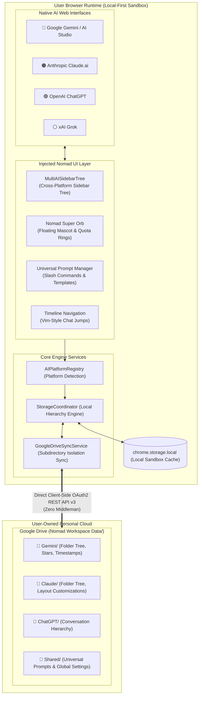

<p align="right">
  <a href="README.md">繁體中文</a> | <b>English</b>
</p>

# 🧭 Nomad AI Workspace

> **All-in-One Multi-AI Workspace Browser Extension**  
> A local-first, zero-trust browser enhancement suite designed for Google Gemini, Anthropic Claude, OpenAI ChatGPT, and xAI Grok. Injects cross-platform hierarchical sidebar folder trees into native AI interfaces, safely segregated in user-owned Google Drive subdirectories.

[](LICENSE)
[](CHANGELOG.md)
[](#-supported-platform-matrix)
[](https://github.com/boboidvtw/nomad-ai-workspace)
[](https://www.paypal.me/boboidvtw)

---

## 📖 About The Project

In modern software engineering and knowledge work, developers and researchers navigate between multiple frontier AI platforms daily: using **Claude** for complex programming, code reviews, and Artifacts architectural refinement; using **Gemini** for massive 2M+ context window analysis and multimodal reasoning; and utilizing **ChatGPT** or **Grok** for rapid ideation and real-time community pulse.

However, existing multi-AI workflows face two critical pain points:

1. **Data Silos and Fragmentation**: Each AI platform isolates its conversation organization, folder structures, and prompts in separate silos, lacking unified search and hierarchical structuring across platforms.
2. **Privacy Risks of Proprietary Tools**: Most commercial all-in-one extensions adopt closed-source paid subscriptions ($5–$15/month) and force users to proxy sensitive conversations and proprietary prompts through third-party servers, creating unacceptable privacy and data leak liabilities.

**Nomad AI Workspace** adheres to the core philosophy of **"Roam Freely, Nest Safely"**, delivering an open-source, local-first, zero-trust browser extension:

- **Physical Subdirectory Isolation**: Platform conversations and configurations are segregated into independent subdirectories within your personal Google Drive, guaranteeing data autonomy and zero cross-contamination.
- **Cross-Platform Sidebar Integration**: Injects a unified multi-AI folder tree directly into the official web interfaces of Gemini, Claude, and ChatGPT, complete with brand-colored badges and zero-latency platform switching.
- **Universal Prompt Manager & Nomad Super Orb**: Craft a prompt once and recall it anywhere with `/` slash commands, interactive variable modal fill-ins, and a flagship floating orb equipped with Apple Watch-style dual-track activity usage rings.
- **🖥️ Nomad AI Studio Standalone Desktop Workstation**: Brand new Electron 40 desktop client (`packages/desktop`) aggregating 4 frontier AIs with Quad (4-panel grid), Dual (split-screen), and Focus (single-view) layouts.
- **⚡ Concurrent Prompt Injection**: Broadcast questions to Claude, ChatGPT, Gemini, and Grok simultaneously from a unified input bar with automatic prompt submission and instant side-by-side benchmark comparison.
- **🤖 Bots: AI teammates with identity, memory and a permanent chat**: each Bot has an `@handle`, a persona and one bound AI conversation. Bots run routines, take `@mention` assignments, message each other and debate in group rooms, and they tell you when they hit a usage limit or a sign-in page. herdr-managed CLI agents (Claude Code, Codex) can be Bots too. See [SPEC-AGENT-BOTS](SPEC-AGENT-BOTS.md).
- **📦 Multi-Platform Native Package Support**: Available for macOS (`.dmg` / `.zip`), Windows (`.exe`), and Linux (`.AppImage` / `.deb`), downloadable directly from [GitHub Releases](https://github.com/boboidvtw/nomad-ai-workspace/releases/latest).
- **100% Client-Side Zero Server Architecture**: No intermediary backend servers exist. All data synchronizes directly between the local browser sandbox and your personal Google Drive via client-side OAuth 2.0.

---

## 🏛️ Architecture Overview



---

## ✨ Key Features

### 1. 🗂️ Unified Multi-AI Hierarchical Sidebar

- **Native Interface Injection**: Seamlessly embeds into the native sidebars of Gemini, Claude, and ChatGPT.
- **Brand Color Badges**: Top-level root nodes clearly distinguish each platform (🔵 **Gemini** / 🟠 **Claude** / 🟢 **ChatGPT** / ⚪ **Grok** / 🟣 **DeepSeek**).
- **Multi-Level Nested Folders**: Create nested subfolders, drag-and-drop conversations to reorganize, and assign custom folder accent colors.
- **Instant Cross-Platform Navigation**: Click a conversation on the active platform for immediate in-page navigation; click a conversation from another platform (marked with an ↗️ icon) to launch it in a new tab.

### 2. ☁️ Google Drive Architecture: Subdirectory Isolation Backup

- **Physical Partitioning**: Backups are partitioned into distinct directories on Google Drive to prevent concurrent write collisions across multiple open tabs:
  ```text
  📁 Google Drive/
  └── 📁 Nomad Workspace Data/
      ├── 📁 Gemini/       <-- Conversation hierarchy, starred messages & timeline
      ├── 📁 Claude/       <-- Conversation folders & custom layouts
      ├── 📁 ChatGPT/      <-- Conversation folder archives
      ├── 📁 Grok/         <-- Conversation folder archives
      └── 📁 Shared/       <-- Universal prompt vault (universal_prompts.json) & settings
  ```
- **Minimum-Privilege Privacy**: OAuth scope is strictly limited to `drive.file` (only permits reading and writing files created by this extension itself; cannot access your existing private Drive files).
- **Custom OAuth Client ID**: Empowers users to configure their own Google Cloud Console OAuth 2.0 Client ID for complete connection sovereignty.

### 3. ⚡ Universal Prompt Vault & Flagship Super Orb

- **Cross-Platform Prompts**: Prompts refined in Claude can be instantly recalled inside Gemini or ChatGPT with a single click.
- **Slash Command Quick Search (`/`)**: Type `/` in the chat input area followed by keywords to fuzzy match and insert prompts on the fly.
- **Dynamic Template Variables**: Supports `{{variable_name}}` dynamic placeholders, automatically displaying a parameter modal to assemble complete prompts before insertion.
- **Nomad Super Orb**: An ambient, glowing mascot floating button anchored beside the central chat composer with concentric dual-track usage monitoring rings (5-hour and 7-day rate limit indicators) and responsive anti-occlusion clamping.

### 4. ⌨️ Conversation Timeline & Speed Navigation

- **Vim-Style Single-Key Navigation**: Jump through conversation turns with `j` (next turn), `k` (previous turn), `gg` (jump to first message), and `GG` (jump to latest answer).
- **IME & Input Protection**: Automatically silences keyboard shortcuts while the cursor is inside text input fields or during IME composition (Chinese / Japanese / Korean).
- **Accidental Send Prevention**: Configurable `Cmd/Ctrl + Enter` submission with upload delay guards while images or attachments are processing.

### 5. 📊 Scientific Rendering & Lossless Multi-Format Export

- **Comprehensive Diagrams & Math**: Built-in rendering support for KaTeX/LaTeX math equations, Mermaid sequence/flow charts, WaveDrom digital logic timing diagrams, and ECharts interactive charts.
- **Lossless Clean Export**: Export conversations to clean Markdown (`.md`), high-resolution PNG images, or formatted PDF documents with syntax-highlighted code and rendered math formulas intact.

### 6. 🤖 Bots: Persistent Identity, Canonical Chats & Multi-Bot Collaboration

Inspired by [Hermes Agent](https://github.com/NousResearch/hermes-agent) Bot Mode and the [herdr](https://github.com/herdrdev/herdr) agent state model, the Agent Roster becomes a roster of teammates who remember you:

- **Canonical chat**: the first task opens a new conversation, sends the persona and binds it; every later task returns to that conversation.
- **Five states**: `idle / working / blocked / done / unknown`. A usage limit, sign-out or rate limit marks the Bot as blocked and notifies you; the run resumes once you fix it.
- **Routines, @mentions, bot-to-bot messages and group rooms** live in the Dashboard **🤖 Bots** tab. Bot-to-bot messaging is bounded by a hop limit and a loop guard.
- **Local first**: settings stay in `~/.nomad/roster.json` and `rooms.json`; Drive sync carries personas only, never conversation URLs.

See [User Guide §7.10](docs/USER_GUIDE_EN.md#710-bots-persistent-identity-canonical-chats--multi-bot-collaboration).

---

## 📱 Supported Platform Matrix

| AI Platform          |     Status      | Supported Domains                             | Hierarchical Sidebar | Universal Prompts | Segregated Drive Backup |
| :------------------- | :-------------: | :-------------------------------------------- | :------------------: | :---------------: | :---------------------: |
| **Google Gemini**    | 🟢 Full Support | `gemini.google.com`, `business.gemini.google` |          ✅          |        ✅         |      ✅ `Gemini/`       |
| **Google AI Studio** | 🟢 Full Support | `aistudio.google.com`, `aistudio.google.cn`   |          ✅          |        ✅         |      ✅ `Gemini/`       |
| **Anthropic Claude** | 🟢 Full Support | `claude.ai`                                   |          ✅          |        ✅         |      ✅ `Claude/`       |
| **OpenAI ChatGPT**   | 🟢 Full Support | `chatgpt.com`, `chat.openai.com`              |          ✅          |        ✅         |      ✅ `ChatGPT/`      |
| **xAI Grok**         | 🟢 Full Support | `grok.com`, `x.com/i/grok`                    |          ✅          |        ✅         |       ✅ `Grok/`        |
| **DeepSeek**         |   🔵 Planned    | `chat.deepseek.com`                           |       Planned        |        ✅         |     ✅ `DeepSeek/`      |

---

## 🧭 Documentation Index

| Document                                                  | Description                                                                                                        |
| :-------------------------------------------------------- | :----------------------------------------------------------------------------------------------------------------- |
| 📖 [User Manual & Tutorial](docs/USER_GUIDE.md)           | Multi-platform guide, sidebar operations, prompt manager, keyboard shortcuts, and export tutorial.                 |
| ☁️ [Google Drive Setup Guide](docs/GOOGLE_DRIVE_SETUP.md) | Google Cloud project creation, OAuth 2.0 Client ID generation, and backup/restore workflows.                       |
| 📦 [Installation & Build Guide](docs/INSTALLATION.md)     | Step-by-step instructions for building and loading unpacked extensions on Chrome, Edge, Firefox, and Safari.       |
| 🚀 [Release & Packaging Guide](docs/RELEASE_PACKAGING.md) | Chrome Web Store review descriptions, single-purpose declarations, permission justifications, and GitHub Releases. |
| 🏛️ [Architecture Specification](docs/ARCHITECTURE.md)     | Multi-layer architecture, dynamic adapters, data models, and zero-trust security design.                           |
| 🤖 [Bots Spec (SPEC-AGENT-BOTS)](SPEC-AGENT-BOTS.md)      | Bots design, data model, API, milestones and implementation notes (Traditional Chinese).                           |
| 📝 [Changelog](CHANGELOG.md)                              | Version history following the Keep a Changelog standard.                                                           |

---

## ⚡ Quick Start

### Build from Source

```bash
# 1. Clone the repository
git clone https://github.com/boboidvtw/nomad-ai-workspace.git
cd nomad-ai-workspace

# 2. Install dependencies (bun or npm recommended)
npm install

# 3. Build the Chrome extension package
npm run build:chrome
```

### Load into Your Browser

1. Open Google Chrome and navigate to `chrome://extensions/`.
2. Enable **"Developer mode"** in the top-right corner.
3. Click **"Load unpacked"** and select the **`dist_chrome`** directory inside the repository.
4. Visit [Google Gemini](https://gemini.google.com/), [Anthropic Claude](https://claude.ai/), or [OpenAI ChatGPT](https://chatgpt.com/) to experience Nomad AI Workspace!

---

## 🏗️ Tech Stack

- **Core Architecture**: TypeScript, React 19, Chrome Extensions MV3
- **Build System**: Vite 6+, `@crxjs/vite-plugin`, Bun / Node.js
- **Design & Styling**: Tailwind CSS v4, Lucide Icons
- **Cloud Synchronization**: Google Drive REST API v3 (Direct Client Flow / Minimal `drive.file` Scope)
- **Internationalization**: i18next (Built-in Traditional Chinese, English, etc.)
- **Code Quality**: oxc (oxlint, oxfmt), Vitest

---

## 📜 License & Attributions

This project is licensed under the **[GNU General Public License v3.0 (GPL-3.0)](LICENSE)**.

### Attributions

Nomad AI Workspace builds upon insights and foundations laid by pioneer open-source projects. Heartfelt thanks to:

- **[voyager-crew/voyager](https://github.com/voyager-crew/voyager)**: Outstanding Gemini/AI workspace enhancement extension created by Jesse Zhang and contributors (licensed under GPL-3.0).
- **[Qiuner/claude-nexus](https://github.com/Qiuner/claude-nexus)**: Thoughtful Claude conversation folder and tag management extension (licensed under MIT).

For comprehensive third-party notices and licenses, see [THIRD_PARTY_NOTICES.md](THIRD_PARTY_NOTICES.md).

---

## ❤️ Sponsor & Support

If **Nomad AI Workspace** enhances your multi-AI development flow and productivity, please consider sponsoring through PayPal to support continued maintenance and feature enhancements:

[](https://www.paypal.me/boboidvtw)

Your support fuels the sustainable growth of open-source software!
