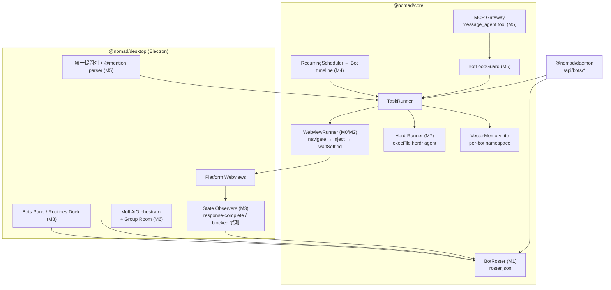

# SPEC-AGENT-BOTS: Nomad Bots 整合方案（借鏡 Hermes Bot Mode 與 herdr）

> 狀態：**M0–M8 已實作（2026-10-11）**，實作紀錄見 §11　｜　日期：2026-10-11　｜　前置文件：[SPEC-TASK-CONTROL-PLANE.md](SPEC-TASK-CONTROL-PLANE.md)

## 0. 結論

把現有 `@nomad/core` 的 **Agent Roster**（派工用的「職位」）升級成 **Bot**（有身分、有記憶、有永久對話的「同事」）。**不另外建新的 primitive**：Bot 就是在 roster entry 上多加幾個欄位，做法跟 Hermes「A Bot is a profile」一樣。

拆成 9 個 Milestone，分三期交付：

| 期別         | 內容                                              | 估計工時* | 交付價值                                                      |
| ------------ | ------------------------------------------------- | --------- | ------------------------------------------------------------- |
| Phase 1 地基 | M0 修 bug、M1 持久化、M2 永久對話                 | 4–6 人日  | 排程任務真的能拿到 AI 回覆，每個 Bot 有固定對話               |
| Phase 2 協作 | M3 五態狀態、M4 Routines、M5 @mention 與 Bot 互傳 | 6–9 人日  | Bot 會自己回報卡住；排程結果回到 Bot 的對話；Bot 可以互相交辦 |
| Phase 3 擴充 | M6 Group Room、M7 herdr runner、M8 Bots UI        | 6–10 人日 | 多 Bot 會議室、CLI agent 也能派工、完整 UI                    |

\* 工時是推估（單人、熟悉 codebase），沒有歷史數據校準。

**動工前必須先做 M0**：目前「把任務派給網頁版 AI」這條路，**拿不到 AI 的回覆**（見 §2.2 G3）。

---

## 1. 目標與非目標

### 1.1 目標

1. 每個 agent 有**持久身分**：名稱、角色、persona、頭像，可以編輯，重啟後也還在。
2. 每個 Bot 有一個**永久對話（Canonical Bot Chat）**，固定綁在某個 AI 平台的某一個對話 URL 上。
3. **排程（Routine）綁在 Bot 上**，執行結果寫回該 Bot 的對話與時間軸。
4. Bot 之間可以**互相交辦**：使用者用 `@bot` 指派，Bot 也可以透過 tool 主動傳訊息，並有防無限迴圈機制。
5. Agent 狀態從 4 態擴充為**五態**（idle / working / blocked / done / unknown），能偵測「需要人介入」。
6. 向下相容：既有 74+ 測試（目前實測 131 個）與 `DEFAULT_ROSTER` 的行為不能壞。

### 1.2 非目標（明確不做）

| 不做                                           | 理由                                                 |
| ---------------------------------------------- | ---------------------------------------------------- |
| Hermes 的 Bot Screen（每個 Bot 一個 VNC 桌面） | Electron webview 本來就看得到畫面，人也能直接接手    |
| 跨機器 Bot relay（`hermes peer`）              | 成本高，不在 Nomad「單機、local-first」的定位內      |
| 每個 Bot 各自隔離憑證                          | 網頁版 AI 共用使用者的登入 session，技術上做不到隔離 |
| 取代 SPEC-TASK-CONTROL-PLANE 的任務模型        | 本案是**疊加**在上面，task / lease / approval 都沿用 |

---

## 2. 現況盤點

### 2.1 已經有、可以直接沿用的部分

| 能力                                                                   | 位置                                                | 備註                                        |
| ---------------------------------------------------------------------- | --------------------------------------------------- | ------------------------------------------- |
| Roster（id、role、platform、skills、maxConcurrency、budgetTokenLimit） | `packages/core/src/tasks/roster.js`                 | `registerAgent`、`findBestAgentForSkills`   |
| Task 狀態機、lease、heartbeat                                          | `packages/core/src/tasks/dispatcher.js`             | 用 tmp 檔加 rename 做原子寫入，可直接沿用   |
| Approval Gate                                                          | `packages/core/src/tasks/approval-gate.js`          |                                             |
| 排程，且**已有 `assignee` 欄位**                                       | `packages/core/src/tasks/recurring-scheduler.js:20` | 已經能指派給 agent，缺的是「結果回寫」      |
| 多 AI 交接（relay / debate / master）                                  | `packages/desktop/src/orchestrator.js`              | `waitForSettledResponse()` 能等 AI 回完     |
| 向量記憶                                                               | `packages/core/src/memory/vector-memory-lite.js`    | 可以當作 Bot 長期記憶的底層                 |
| MCP Gateway                                                            | `packages/core/src/mcp/mcp-gateway.js`              | 用來對 agent 暴露 `message_agent` tool      |
| Daemon REST                                                            | `packages/daemon/src/server.js:564-630`             | 已有 `GET/POST /api/roster`、`/api/tasks/*` |

### 2.2 缺口（Gap）

| #   | 缺口                                                   | 證據                                                                                                                                                                                                                                        | 影響                                                         |
| --- | ------------------------------------------------------ | ------------------------------------------------------------------------------------------------------------------------------------------------------------------------------------------------------------------------------------------- | ------------------------------------------------------------ |
| G1  | Roster **沒有持久化**；`POST /api/roster` 只寫進記憶體 | `dispatcher.saveToDisk()` 只序列化 `this.tasks`（`dispatcher.js:68`）                                                                                                                                                                       | 重啟後自訂的 agent 會消失                                    |
| G2  | 沒有 persona、頭像、永久對話等身分欄位                 | `roster.js` 的 `Agent` typedef                                                                                                                                                                                                              | 每次派工都是在「某個平台」上，不是派給「某個對話」           |
| G3  | **[BUG]** 網頁版 runner 拿不到 AI 回覆                 | `task-runner.js` 讀的是 `orchRes?.text`；但 `main.js:514` 的 `dispatchPromptToTargets()` 回傳 `{ [platform]: { ok, data } }`，而且只注入、不等回覆。測試 mock（`bridge-tasks.test.js:49`）回傳 `{ text }`，和實際契約不一致，所以測試沒抓到 | 派給網頁 AI 的任務，artifact 一律是 `"Delegated to webview"` |
| G4  | 排程結果只進 task artifact，**沒有回到 agent 的對話**  | `recurring-scheduler.js:307-370`                                                                                                                                                                                                            | 使用者要去任務看板才找得到結果                               |
| G5  | 狀態只有 idle / busy / paused / offline                | `roster.js:10`                                                                                                                                                                                                                              | 偵測不到「AI 在等人確認、撞到 rate limit、需要登入」         |
| G6  | Agent 之間的溝通完全由 orchestrator 範本驅動           | `orchestrator.js:19-45`                                                                                                                                                                                                                     | Agent 不能主動找別人；也沒有 @mention                        |
| G7  | 沒有 CLI agent（Claude Code、Codex）的 runner          | `task-runner.js` 只有 local-model、webview、mock 三條路                                                                                                                                                                                     | 不能把 coding 任務派給終端機裡的 agent                       |

基準測試：`npm run test:monorepo` → core 64、daemon 17、desktop 50，**共 131 個全過**（2026-10-11 實測）。

---

## 3. 借鏡來源

| 來源                                                                              | 借什麼                                                                                                                                       | 對應 Milestone     | 不借什麼                                         |
| --------------------------------------------------------------------------------- | -------------------------------------------------------------------------------------------------------------------------------------------- | ------------------ | ------------------------------------------------ |
| Hermes Bot Mode（`~/Developer/hermes-agent/website/docs/user-guide/bot-mode.md`） | Bot 等於既有 profile 加上 UI；永久 Bot Chat（`/new` 改成 compact）；Routine 綁在 Bot 上；`message_agent` tool；Group room 的排隊與 Stop 語意 | M1、M2、M4、M5、M6 | Bot Screen、跨機器 relay、profile 層級的憑證隔離 |
| Hermes `gateway/bot_loop_guard.py`                                                | 用滑動視窗限制 Bot 之間互傳的次數，防止無限迴圈                                                                                              | M5                 | —                                                |
| herdr（`herdrdev/herdr` v0.9.3，Apache-2.0）                                      | 五態 agent 狀態加 seen 標記；manifest 驅動的偵測規則；`herdr agent start/wait` CLI                                                           | M3、M7             | TUI 與 PTY 管理（Nomad 不負責終端機）            |

**License**：只借設計概念。若要移植 herdr 的程式碼（Apache-2.0 → GPL-3.0，單向相容），要在 `THIRD_PARTY_NOTICES.md` 補上 NOTICE。Hermes 是 MIT，同樣處理。

---

## 4. 設計

### 4.1 設計原則

1. **擴充，不取代**：`Bot` 就是 `Agent` 加上選填欄位。舊的 roster entry 不用遷移就能繼續運作。
2. **沿用 Result Pattern 與命名式 ErrorCodes**（`ROSTER_*`、新增 `BOT_*`）。
3. **持久化方式和 dispatcher 一致**：JSON 檔、tmp 加 rename 原子寫入，路徑放在 `~/.nomad/`。
4. **Feature flag**：在 store 加 `bots.enabled`（預設 `false`，到 Phase 1 驗收後再改成 `true`），出事時一鍵回滾。
5. **TDD**：每個 Milestone 先寫失敗的測試，用 `node --test` 跑，保持現有測試結構。

### 4.2 資料模型

```js
/**
 * @typedef {import('./roster').Agent & BotFields} Bot
 *
 * @typedef {Object} BotFields
 * @property {string} [displayName]      // @mention 用的友善名稱，例：'Research Buddy' → @research-buddy
 * @property {string} [persona]          // 第一輪注入的角色 system prompt
 * @property {string} [avatar]           // emoji 或 data URI
 * @property {CanonicalChat | null} [canonicalChat]
 * @property {string} [memoryNamespace]  // vector-memory-lite 的 namespace，預設 = id
 * @property {string[]} [sections]       // 使用者自訂分組（Clients、Team…）
 * @property {boolean} [hidden]          // 只影響顯示，不影響 @mention 與 routine
 * @property {BotState} [state]          // M3 的五態，取代 UI 層使用的 status
 * @property {string} [lastSeenAt]       // 用來區分 done 與 idle
 * @property {string} createdAt
 * @property {string} updatedAt
 *
 * @typedef {Object} CanonicalChat
 * @property {string} platform           // 'claude' | 'chatgpt' | 'gemini' | 'grok' | 'local-model' | 'herdr'
 * @property {string | null} url         // 第一次執行後回填，例：https://claude.ai/chat/<uuid>
 * @property {string | null} [herdrAgentName]
 * @property {string} [boundAt]
 *
 * @typedef {'idle'|'working'|'blocked'|'done'|'unknown'} BotState
 */
```

儲存位置是 `~/.nomad/roster.json`。`DEFAULT_ROSTER` 只在檔案不存在時當作種子資料。

### 4.3 架構



**信任邊界**：AI 回覆的文字（WV、herdr 的輸出）一律視為**資料**。

- `message_agent` 的內容只能當作下一個 Bot 的 user message，不能觸發 approval bypass 或系統動作。
- herdr 的參數一律用 `execFile` 傳入，不經過 shell。

---

## 5. Milestones

每個 Milestone 都是獨立的 PR，分支名稱 `feat/bots-mN-<slug>`。**完成條件 = 測試先紅後綠，加上 `npm run test:monorepo` 全綠，加上 `typecheck` 通過。**

### M0　修正 Webview Runner 回覆擷取 [BUG FIX]　（1 人日）

| 項目 | 內容                                                                                                                                                                                                                                                                                                                     |
| ---- | ------------------------------------------------------------------------------------------------------------------------------------------------------------------------------------------------------------------------------------------------------------------------------------------------------------------------ |
| 問題 | G3：`orchRes?.text` 永遠是 `undefined`，而且注入後不等回覆                                                                                                                                                                                                                                                               |
| 做法 | 1. 在 desktop 新增 `dispatchAndAwait(platform, prompt)`：注入 → 呼叫 `orchestrator.waitForSettledResponse(platform)` → 回傳 `{ success, data: { text } }`<br>2. `bridge.js:104` 的 `orchestratorDelegate` 改走這個函式<br>3. `task-runner.js` 改用 Result 型別讀 `data.text`；失敗時走 `failTask`，不要再塞假的 artifact |
| 測試 | 修正 `bridge-tasks.test.js:49` 的 mock，讓它符合實際契約；新增「注入成功但等待逾時 → task failed」的案例                                                                                                                                                                                                                 |
| 驗收 | 手動排程一個任務給 `agent-claude`，artifact 內容是 Claude 實際的回覆                                                                                                                                                                                                                                                     |

### M1　Bot Roster 持久化與 Schema　（1.5 人日）

| 項目       | 內容                                                                                                                                                                                                                 |
| ---------- | -------------------------------------------------------------------------------------------------------------------------------------------------------------------------------------------------------------------- |
| 做法       | `BotRoster extends AgentRoster`：加上 `saveToDisk` / `loadFromDisk`（照抄 dispatcher 的原子寫入）、`updateBot(id, patch)`（回傳新物件，不就地修改）、`removeBot(id)`（有進行中任務時拒絕）、`resolveMention(handle)` |
| 驗證       | `displayName` 轉成 handle 的規則是 `[a-z][a-z0-9_-]{0,31}`（跟 herdr 一致）；handle 不能重複                                                                                                                         |
| Daemon     | 新增 `PATCH /api/roster/:id`、`DELETE /api/roster/:id`；`POST` 改成會持久化                                                                                                                                          |
| ErrorCodes | `BOT_HANDLE_CONFLICT_001`、`BOT_HAS_ACTIVE_TASKS_002`、`BOT_STORAGE_SAVE_FAILED_003`、`BOT_STORAGE_LOAD_FAILED_004`                                                                                                  |
| 測試       | 舊格式的 roster.json 可以載入；檔案毀損時回傳 err 並保留原檔（另存 `.corrupt`）；handle 衝突的情況                                                                                                                   |

### M2　Canonical Bot Chat　（1.5–3 人日）

| 項目        | 內容                                                                                                                                                                                                                                                                                             |
| ----------- | ------------------------------------------------------------------------------------------------------------------------------------------------------------------------------------------------------------------------------------------------------------------------------------------------ |
| 做法        | 1. WebviewRunner 執行前，如果 `canonicalChat.url` 有值，就 `loadURL(url)` 並等待頁面就緒<br>2. 第一次執行時（url 是 null）開一個新對話，先注入 `persona`，等回完之後讀 `webContents.getURL()` 回填 url<br>3. 同一個平台上有多個 Bot 時，用一個 queue 串行化（一個 webview 一次只能服務一個 Bot） |
| 對應 Hermes | 永久對話；archive 之後下一次自動開新的對話並綁定                                                                                                                                                                                                                                                 |
| 風險        | 平台改 URL 結構，或對話被使用者刪掉 → 偵測到 404 或被導回首頁時清空 url，重新綁定，並在 Bot 的時間軸記一筆                                                                                                                                                                                       |
| 驗收        | 同一個 Bot 跑 3 次任務，都在同一個 claude.ai 對話裡；重啟 app 後仍然一樣                                                                                                                                                                                                                         |

### M3　五態狀態偵測（借鏡 herdr）　（2–3 人日）

| 狀態      | 判定（網頁版）                                                                            | 判定（local-model / herdr）       |
| --------- | ----------------------------------------------------------------------------------------- | --------------------------------- |
| `working` | 停止按鈕出現或 streaming 中（沿用 `response-complete-observer.js`）                       | 請求進行中 / `herdr` 回報 working |
| `done`    | 回覆完成，且 `lastSeenAt` 早於完成時間                                                    | 同左                              |
| `idle`    | 回覆完成且已讀                                                                            | 同左                              |
| `blocked` | 符合 **blocked manifest**：rate limit 橫幅、登入頁、"Continue generating"、檔案權限對話框 | herdr 回報 blocked                |
| `unknown` | 以上都不符合，或 observer 逾時                                                            | —                                 |

- Selector 放在 `packages/core/src/bots/state-manifests/<platform>.json`，平台改版時只改 JSON（借鏡 herdr `src/detect/manifests`）。
- 偵測到 `blocked` 時：發送桌面通知，`TaskRunner` 暫停 heartbeat 但**不讓 lease 過期**；等使用者處理完回到 working。
- 舊的 `status`（idle / busy / paused / offline）繼續保留給 dispatcher 判斷容量；`state` 只給 UI 和通知使用，兩者不混用。

### M4　Routines ↔ Bot　（1.5 人日）

| 項目 | 內容                                                                                                                                                                                                                                                                              |
| ---- | --------------------------------------------------------------------------------------------------------------------------------------------------------------------------------------------------------------------------------------------------------------------------------- |
| 做法 | 1. `addSchedule` 驗證 `assignee` 存在於 roster，不存在就回 `TASK_SCHEDULE_INVALID_010`<br>2. `triggerSchedule` 完成後，寫一筆 `BotTimelineEntry { type: 'routine', scheduleId, taskId, summary }`<br>3. 因為 M2 已經讓任務跑在 canonical chat 裡，結果自然就留在那個 Bot 的對話中 |
| 命名 | UI 顯示為 `[bot:<handle>] <routine>`（同 Hermes），方便在任務看板上辨識                                                                                                                                                                                                           |
| 驗收 | 建一個每 5 分鐘的 routine 給 Bot A，跑完後 A 的 canonical chat 和 timeline 裡都看得到結果                                                                                                                                                                                         |

### M5　@mention 路由與 Bot 互傳訊息　（2.5–4 人日）

| 項目         | 內容                                                                                                                                                                       |
| ------------ | -------------------------------------------------------------------------------------------------------------------------------------------------------------------------- |
| 使用者 → Bot | 統一提問列解析 `@handle`，用 `resolveMention` 找到 Bot，對它的 canonical chat 下達指示。多個 `@` 就平行派發。找不到的 `@xxx` 原樣保留（同 Hermes）                         |
| Bot → Bot    | MCP Gateway 暴露 `message_agent({ target, message })`。訊息加上前綴 `Message from 🤖 <name> (@handle)`，再投遞到 target 的 canonical chat，回覆以 tool result 回傳給發送方 |
| 防迴圈       | 移植 `BotLoopGuard`：每個對話鏈在 `windowSeconds=300` 內最多 `maxEvents=20` 次，超過就 `cooldown`；另外加上 `hopLimit=4`（A→B→C→D→停）                                     |
| 安全         | `message_agent` 的 `target` 只能是 roster 裡的 Bot；`message` 長度上限 8KB；不能用它觸發 approval                                                                          |
| 測試         | handle 解析、guard 觸發、hop 上限、未知 target 回傳 err                                                                                                                    |

### M6　Group Room（升級 debate）　（2–3 人日）

| 項目             | 內容                                                                                                                                                                                |
| ---------------- | ----------------------------------------------------------------------------------------------------------------------------------------------------------------------------------- |
| 做法             | 新增 `GroupRoom { id, name, memberIds, log[] }`。使用者發言後，依序驅動成員；成員回覆期間，新的訊息排隊，不中斷；支援 `Stop`（暫停全體）、`@member`（只叫一個）、`@all`（全部恢復） |
| 與現有功能的關係 | `orchestrator.js` 的 debate / relay 改成 GroupRoom 的兩種預設「輪替策略」，舊的 API 保留當作 alias                                                                                  |

### M7　herdr Runner（選配）　（1.5–2 人日）

| 項目   | 內容                                                                                                                              |
| ------ | --------------------------------------------------------------------------------------------------------------------------------- |
| 前提   | 使用者本機已安裝 herdr；啟動時偵測 `herdr --version`，沒有就隱藏這個選項                                                          |
| 做法   | `platform: 'herdr'` → `execFile('herdr', ['agent', 'start', ...])`，接著 `herdr agent wait`，讀 JSON 輸出；結果寫回 task artifact |
| 安全   | 不經過 shell、參數白名單、cwd 只能是使用者指定的 workspace                                                                        |
| 待確認 | herdr CLI 子命令的確切參數要以 `herdr agent --help` 為準（目前只從 SKILL.md 推得，**未實測**）                                    |

### M8　Bots UI　（2–3 人日）

Desktop 加一個 Bots pane（roster、頭像、最新訊息、狀態燈、未讀），Routines 停靠在旁邊。Dashboard 加一個唯讀的 Bots 頁。UI 建好之後再跑 `design:accessibility-review` 檢查。

---

## 6. 時程與依賴

```
M0 ──► M1 ──► M2 ──┬──► M4
                   ├──► M5 ──► M6
                   └──► M3 (可與 M4/M5 平行)
M7 只依賴 M0、M1；M8 依賴 M1–M4
```

| 週次 | 內容           | 里程碑檢查                                   |
| ---- | -------------- | -------------------------------------------- |
| W1   | M0、M1、M2     | Phase 1 驗收，`bots.enabled` 預設改成 `true` |
| W2   | M3、M4、M5     | Phase 2 驗收                                 |
| W3   | M6、M8、（M7） | Phase 3 驗收，發布 v1.5.0                    |

---

## 7. 風險與緩解

| 風險                                                     | 機率 | 影響 | 緩解                                                                                               |
| -------------------------------------------------------- | ---- | ---- | -------------------------------------------------------------------------------------------------- |
| AI 平台改 DOM 或 URL 結構，偵測失效                      | 高   | 中   | manifest 化（M3）；偵測不到就回 `unknown`，不誤報 `done`；保留 `waitForSettledResponse` 的逾時機制 |
| 自動操作網頁版 AI 可能違反平台 ToS 或觸發 rate limit     | 中   | 高   | 預設不自動執行，routine 需手動開啟；每個平台設最小間隔；偵測到 rate limit 進入 `blocked`，不重試   |
| Bot 之間無限互傳，燒掉額度                               | 中   | 高   | BotLoopGuard 加上 hopLimit；沿用 `budgetTokenLimit`                                                |
| 多個 Bot 共用一個 webview，互相干擾                      | 中   | 中   | 每個平台一個 queue 串行化（M2）                                                                    |
| Prompt injection：一個 Bot 的輸出誘導另一個 Bot 執行動作 | 中   | 高   | AI 輸出一律視為資料；`message_agent` 不能觸發 approval；高風險任務一律經過 Approval Gate           |
| roster.json 毀損                                         | 低   | 中   | 原子寫入；載入失敗時另存 `.corrupt`，回退到種子資料並通知                                          |
| 範圍膨脹                                                 | 中   | 中   | 非目標清單（§1.2）；M7、M6 可以延後                                                                |

**回滾方式**：關閉 `bots.enabled` 就回到現有的 roster 與 orchestrator 行為。roster.json 對舊版是多出來的檔案，不影響運作。每個 Milestone 都是獨立的 PR，可以個別 revert。

---

## 8. 驗收指標

| 指標                       | 目標                                                                    |
| -------------------------- | ----------------------------------------------------------------------- |
| 既有測試                   | 131 個全過，不減少                                                      |
| 新增測試                   | 每個 Milestone ≥ 8 個，`packages/core/src/tasks`、`bots` 的覆蓋率 ≥ 80% |
| 網頁 runner 回覆擷取成功率 | 每個平台手動跑 10 次，≥ 9 次拿到完整回覆                                |
| blocked 偵測               | 每個平台各手動觸發 rate-limit / 登入頁 1 次，都能正確進入 `blocked`     |
| 永久對話穩定性             | 同一個 Bot 連續 5 次任務、跨 1 次重啟，都在同一個對話 URL               |
| 防迴圈                     | 單元測試：A↔B 互傳在第 20 次或 hop 4 時停止                             |

---

## 9. 決策（2026-10-11 定案，皆採建議選項）

| #   | 問題                                            | 選項                    | 建議                                                                             |
| --- | ----------------------------------------------- | ----------------------- | -------------------------------------------------------------------------------- |
| D1  | 對外名稱                                        | 「Bot」／ 沿用「Agent」 | **Bot**：與 Hermes 一致，也和現有的 task agent 概念區隔                          |
| D2  | M7 herdr runner 要不要放進這一輪                | 放 ／ 延後              | **延後到 Phase 3 尾**，先把網頁版做穩                                            |
| D3  | roster.json 要不要同步到 Google Drive `Shared/` | 要 ／ 不要              | **要，但只同步 persona 與設定**，不同步 canonical chat URL（URL 跟帳號綁在一起） |
| D4  | Routine 預設是否自動執行                        | 自動 ／ 手動開啟        | **手動開啟**（ToS 與成本風險）                                                   |

---

## 10. 參考

- Hermes Bot Mode 文件：`~/Developer/hermes-agent/website/docs/user-guide/bot-mode.md`（fork 的 commit `3eb7ed08d1`，2026-10-09）
- Hermes 防迴圈實作：`~/Developer/hermes-agent/gateway/bot_loop_guard.py`
- herdr：<https://github.com/herdrdev/herdr>（v0.9.3，2026-09-29；`skills/herdr/SKILL.md`）
- 前置規格：[SPEC-TASK-CONTROL-PLANE.md](SPEC-TASK-CONTROL-PLANE.md)

---

## 11. 實作紀錄（2026-10-11）

### 11.1 Milestone 對照

| Milestone             | Commit                 | 主要檔案                                                                        | 新增測試 |
| --------------------- | ---------------------- | ------------------------------------------------------------------------------- | -------- |
| M0 修正網頁版回覆擷取 | `7763f571`             | `webview-task-runner.js`、`orchestrator.js`（`awaitSettled`）、`task-runner.js` | 17       |
| M1 Bot Roster 持久化  | `be20c4c7`、`fe4b26d4` | `core/src/bots/bot-roster.js`、`bot-routes.js`                                  | 23       |
| M2 永久對話           | `c8df30f9`、`7734b7ae` | `chat-urls.js`、`webview-task-runner.js`                                        | 12       |
| M3 五態偵測           | `5a68179a`             | `state-manifests.js`、`orchestrator.js`（`checkBlocked`）                       | 10       |
| M4 Routines ↔ Bot     | `d95caf84`             | `recurring-scheduler.js`（`routineLabel`、assignee 驗證、預設關閉）             | 6        |
| M5 @mention 與互傳    | `769ba5ce`             | `message-router.js`、`bot-delivery.js`、`studio-bots.js`                        | 19       |
| M6 Group Room         | `c6202716`             | `group-room.js`                                                                 | 11       |
| M7 herdr runner       | `1652ec52`             | `herdr-runner.js`                                                               | 7        |
| M8 Bots UI            | `005d81d5`             | `dashboard/bots-panel.html`、Studio 提示橫幅                                    | 3        |
| D3 Drive 同步         | `d06ba4e0`             | `universal-drive-sync.js`（`nomad-bots.json`）                                  | 2        |
| 回滾開關              | `c6fe5477`             | `store.js`（`bots.enabled`）、`studio-bots.js`                                  | 1        |

測試：`npm run test:monorepo` 從 131 個增加到 **242 個，全部通過**（core 142、daemon 17、desktop 83；新增 111 個）；`typecheck:packages`、`typecheck`、`oxlint`（0 error）、`oxfmt --check`、`regressions:check` 全數通過。

### 11.2 與原計劃不同之處

| 原計劃                                          | 實際做法                                                                                             | 理由                                                                                        |
| ----------------------------------------------- | ---------------------------------------------------------------------------------------------------- | ------------------------------------------------------------------------------------------- |
| `PATCH/DELETE /api/roster/:id`                  | 改為 `/api/bots/*`；`/api/roster` 保留原樣                                                           | Bot 的路由集中在一個 handler，Studio bridge 與 daemon 共用，避免兩份實作漂移                |
| debate / relay 改寫成 GroupRoom 的輪替策略      | `orchestrator.js` 的 relay / debate **維持不變**；GroupRoom 另提供 `round-robin` / `debate` 兩種策略 | 改寫既有 orchestrator 的風險大於收益，而且兩者使用情境不同（即時接力 vs. 有逐字稿的會議室） |
| blocked manifest 用 JSON 檔                     | 改用 JS 模組 `state-manifests.js`                                                                    | core 的 tsconfig 沒開 `resolveJsonModule`；內容一樣是純資料                                 |
| herdr agent 名稱另外設定                        | 預設用 Bot 的 `@handle`；必要時才用 `canonicalChat.herdrAgentName` 覆寫                              | 兩者格式規則完全相同（`[a-z][a-z0-9_-]{0,31}`），少一個要設定的欄位                         |
| Desktop 內建 Bots pane                          | 主要介面放在 Dashboard「🤖 Bots」分頁；Studio 只負責 blocked 提示，點擊開啟 `/dashboard#bots`        | Dashboard 已有任務看板與 SSE；`desktop/index.html` 已超過 4,000 行，不宜再加                |
| `bots.enabled` 預設 `false`，Phase 1 驗收後再改 | 預設 `true`                                                                                          | 三期在同一輪完成；回滾時改設 `false` 即可                                                   |

### 11.3 尚未驗證（需要實機）

| 項目                                             | 原因                                                                                                                                | 驗證方式                                                               |
| ------------------------------------------------ | ----------------------------------------------------------------------------------------------------------------------------------- | ---------------------------------------------------------------------- |
| §8 的網頁版回覆擷取成功率（各平台 10 次 ≥ 9 次） | 需要登入各 AI 平台實際操作，自動化測試無法涵蓋                                                                                      | 啟動 Studio，對每個平台各派 10 次任務，檢查任務產出                    |
| blocked 偵測規則是否命中真實畫面                 | `state-manifests.js` 的文字與 selector 是依各平台常見訊息撰寫的，還沒對照實際 DOM                                                   | 實際觸發用量上限或登出，看 Bot 是否變成「需要你」；沒命中就改 manifest |
| 永久對話跨重啟（5 次任務加 1 次重啟）            | 需要實機                                                                                                                            | 同上                                                                   |
| herdr runner 實際執行                            | 本機沒有安裝 herdr；CLI 契約取自 herdr v0.9.3 原始碼（`src/cli/agent.rs`、`src/api/schema/response.rs`），測試使用模擬的 `execFile` | 安裝 herdr，建立名稱與 `@handle` 相同的 agent，從 Bots 分頁派工        |
| Dashboard Bots 分頁                              | **已用假資料的 bridge 在瀏覽器實測**：名單、詳情編輯、@mention 派送（含 HTML 跳脫）、會議室輪流發言、SSE 更新都正常                 | —                                                                      |
