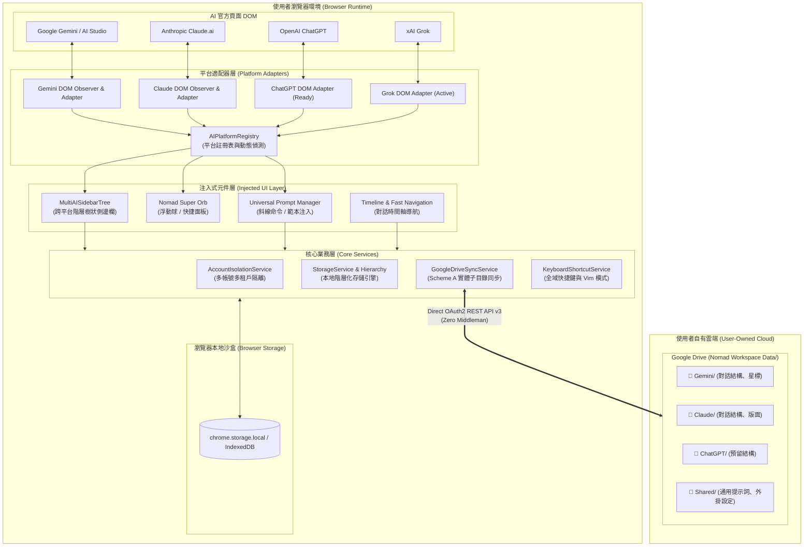

# 🏛️ Nomad AI Workspace 架構總覽 (Architecture Overview)

> 本文件詳述 **Nomad AI Workspace** 瀏覽器擴充套件之核心系統架構、模組切分、跨平台適配器與資料隔離同步機制。

---

## 📐 1. 系統整體拓撲 (System Architecture)

Nomad AI Workspace 採用 **純客戶端 (Client-Side Only)** 與 **本地優先 (Local-First)** 設計，絕不設立任何中繼伺服器或轉發代理。所有狀態僅存於使用者的本機瀏覽器沙盒快取（`chrome.storage.local`）與個人 Google Drive 專屬目錄中。



---

## 🧩 2. 核心分層架構 (Layered Design)

### 2.1 注入與適配器層 (Platform Adapters & Injection)
- **`src/core/platform/registry.ts`**：
  - 系統單一真相來源 (SSOT)，定義各平台的 ID、網域名稱、品牌主色、Google Drive 對應子資料夾及啟用狀態 (`active` / `ready` / `planned`)。
  - 提供 `detectCurrentPlatform()` 根據當前分頁 URL 自動判定對應平台環境。
- **動態注入機制**：
  - 在 Gemini 頁面注入原生側邊欄觀測器（`NativeSidebarObserver.ts`）與階層側邊欄管理器。
  - 在 Claude 頁面掛載 `gv-claude-page` 容器，渲染 `FolderManager`、`Timeline` 與雙球合一的 `Nomad Super Orb`。
  - 對話輸入框注入 Slash Prompt 監聽器，即時補捉 `/` 觸發自訂提示詞選單。

### 2.2 跨平台階層側邊欄 (`MultiAISidebarTree.tsx`)
- **單一視覺整合**：
  - 集中檢視使用者在所有 AI 平台上儲存的對話與分類資料夾。
  - 頂層為各 AI 平台根節點，帶有鮮明的官方配色徽章：
    - 🔵 **Google Gemini** (`#4E88F5`)
    - 🟠 **Anthropic Claude** (`#D97757`)
    - 🟢 **OpenAI ChatGPT** (`#10A37F`)
    - ⚪ **xAI Grok** (`#1D9BF0`)
    - 🟣 **DeepSeek** (`#4D6BFE`)
- **跨平台導航邏輯**：
  - 當點擊目前所在平台的會話：透過 SPA 原生導航無刷新切換。
  - 當點擊非當前平台的會話：自動開啟新分頁並導向目標對話，連結旁附帶外部跳轉圖示（↗️）。
- **資料掛載 Hook (`useCrossPlatformFolders.ts`)**：
  - 監聽 `chrome.storage.onChanged`，當其他視窗或背景同步更新資料夾結構時，即時重繪側邊欄樹狀圖。

### 2.3 通用提示詞管理器 (`Universal Prompt Manager`)
- **跨端資料共享**：
  - 提示詞定義於通用模型中，不再局限於特定 AI 引擎。
  - 支援標籤（Tags）、置頂（Pinning）與即時搜尋過濾。
- **模板填寫機制 (`PromptTemplateFill.ts`)**：
  - 支援 `{{變數名稱}}` 語法。當選擇含有動態變數的提示詞時，自動彈出輸入彈窗，填寫完畢後無縫注入輸入框。
- **斜線喚起觸發器 (`slashPrompt.ts`)**：
  - 在輸入框鍵入 `/` 搭配關鍵字即可直接在游標處搜尋與置換提示詞，支援鍵盤上下鍵導航與 `Enter` 快速選擇。

---

## ☁️ 3. Google Drive 方案 A：實體子目錄隔離架構 (Scheme A Segregated Storage)

### 3.1 為什麼堅持實體子目錄隔離？
市面上許多工具將所有備份雜湊揉合在單一巨大的 JSON 檔案中，極易引發以下問題：
1. **多端併發寫入覆蓋 (Race Condition)**：在 Claude 與 Gemini 同時對話時，雲端同步容易相互覆蓋。
2. **單點損壞風險**：單一格式解析錯誤將導致所有 AI 平台的歷史與提示詞全毀。
3. **資料無法獨立檢視**：使用者無法在 Google Drive 中直接檢視或還原特定平台的資料。

### 3.2 實體目錄層級結構
Nomad AI Workspace 嚴格建立並維護以下雲端階層：

```text
📁 我的雲端硬碟 (My Drive)/
└── 📁 Nomad Workspace Data/                      <-- 根備份目錄
    ├── 📄 nomad_manifest.json                   <-- 跨平台同步中繼資訊與時間戳記
    ├── 📁 Gemini/                                <-- Google Gemini 專屬隔離區
    │   ├── 📄 gemini_folders.json               <-- 階層資料夾與對話樹
    │   ├── 📄 gemini_starred.json               <-- 星標與重要訊息
    │   └── 📄 gemini_timeline.json              <-- 時間軸快取
    ├── 📁 Claude/                                <-- Anthropic Claude 專屬隔離區
    │   ├── 📄 claude_folders.json               <-- 對話分類資料夾
    │   └── 📄 claude_layout.json                <-- 自訂版面設定
    ├── 📁 ChatGPT/                               <-- OpenAI ChatGPT 專屬隔離區
    │   └── 📄 chatgpt_folders.json              <-- (擴充中)
    ├── 📁 Grok/                                  <-- xAI Grok 專屬隔離區
    │   └── 📄 grok_folders.json                 <-- 對話結構歸檔
    └── 📁 Shared/                                <-- 跨平台通用共享區
        ├── 📄 universal_prompts.json             <-- 跨平台通用提示詞庫
        ├── 📄 custom_plugins.json                <-- 外掛與自訂腳本設定
        └── 📄 nomad_settings.json                <-- 全域偏好與快捷鍵配置
```

### 3.3 同步協同與衝突解決 (`GoogleDriveSyncService.ts`)
- **多帳號租戶隔離 (`AccountIsolationService.ts`)**：
  - 根據目前登入的 Google 帳號與路徑命名空間（例如 `/u/0/`、`/u/1/`）隔離儲存鍵名。
- **智慧合併演算法 (`merge.ts`)**：
  - **資料夾合併**：依據資料夾唯一 UUID 識別，若雙端皆修改同名資料夾，保留子項目並以最新更新時間戳記（`updatedAt`）為準。
  - **提示詞合併**：若內容相異則自動建立副本或提示衝突，避免使用者珍貴精心編寫的 Prompt 被抹除。

---

## 🔒 4. 零信任隱私與安全模型 (Zero-Trust Security)

1. **無第三方 API 中繼**：
   - 擴充套件直接透過 `fetch()` 與 Google Drive 官方 API (`https://www.googleapis.com/upload/drive/v3/files`) 溝通。
   - 所有 OAuth 2.0 Token 僅在瀏覽器端記憶體與加密本機存儲中流轉。
2. **最小權限原則**：
   - OAuth 範圍嚴格限定為 `https://www.googleapis.com/auth/drive.file`。此權限**只能讀取與寫入 Nomad AI Workspace 自身建立的檔案與目錄**，完全無法存取使用者雲端硬碟中的私人文件或照片。
3. **自訂 Client ID 支援**：
   - 使用者可選擇自行在 Google Cloud Platform 建立專屬 OAuth Client ID，將連線所有權完全掌握在個人手中。

