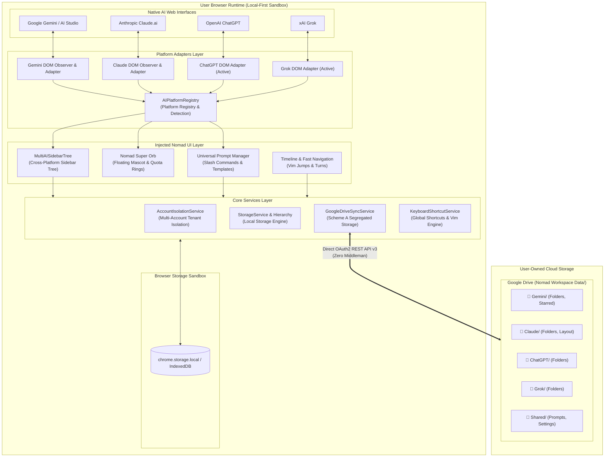

<p align="right">
  <a href="ARCHITECTURE.md">繁體中文</a> | <b>English</b>
</p>

# 🏛️ Nomad AI Workspace Architecture Overview

> This document details the core system architecture, component decomposition, platform adapters, and segregated data synchronization mechanisms of the **Nomad AI Workspace** browser extension.

---

## 📐 1. System Topology

Nomad AI Workspace adheres strictly to a **Client-Side Only** and **Local-First** design without intermediary backend servers or proxy relays. All state resides exclusively inside the user local browser sandbox (`chrome.storage.local` / IndexedDB) and their personal Google Drive storage.



---

## 🧩 2. Core Layered Design

### 2.1 Platform Adapters & Injection

- **`src/core/platform/registry.ts`**:
  - The Single Source of Truth (SSOT) defining platform IDs, domain names, brand colors, Google Drive subfolder mappings, and lifecycle status (`active` / `ready` / `planned`).
  - Provides `detectCurrentPlatform()` to dynamically resolve platform context based on active tab URLs.
- **Dynamic Injected Observers**:
  - **Gemini**: Mounts native sidebar observer (`NativeSidebarObserver.ts`) and hierarchical folder tree.
  - **Claude**: Mounts `gv-claude-page` container with `FolderManager`, `Timeline`, and `FloatBall`.
  - **ChatGPT**: Injects `ChatGPTFolderManager` and emerald-accented `FloatBall`.
  - **Grok**: Integrates Shadcn UI-compliant `GrokFolderManager` and tech-blue `FloatBall` with layout isolation.
  - Composer inputs across all platforms mount live slash-command listeners to trigger prompt autocomplete.

### 2.2 Cross-Platform Sidebar Tree (`MultiAISidebarTree.tsx`)

- **Unified Visual Directory**:
  - Aggregates conversation archives across all supported platforms into a single sidebar tree.
  - Displays distinctive official brand badges:
    - 🔵 **Google Gemini** (`#4E88F5`)
    - 🟠 **Anthropic Claude** (`#D97757`)
    - 🟢 **OpenAI ChatGPT** (`#10A37F`)
    - ⚪ **xAI Grok** (`#1D9BF0`)
    - 🟣 **DeepSeek** (`#4D6BFE` — planned)
- **Zero-Latency Navigation**:
  - In-platform navigation executes via SPA pushState for instantaneous switching.
  - Cross-platform navigation opens or focuses targeted conversations in dedicated tabs (annotated with ↗️).

### 2.3 Universal Prompt Manager

- **Cross-Engine Template Sharing**:
  - Prompts are defined once and recalled across Gemini, Claude, ChatGPT, and Grok.
  - Supports tags, pinning, and fuzzy text search.
- **Interactive Variable Fill-In**:
  - Supports mustache syntax `{{variable}}`. Triggers a modal popup on selection to inject values directly into chat inputs.

---

## ☁️ 3. Google Drive Scheme A: Segregated Storage Architecture

### 3.1 Why Physical Subdirectory Segregation?

Many commercial extensions mash all platform backups into a single monolithic JSON file, causing severe issues:

1. **Race Conditions**: Concurrent sessions on Claude and Gemini easily overwrite each other.
2. **Single Point of Corruption**: A single malformed JSON payload destroys the entire history for all platforms.
3. **Lack of Inspectability**: Users cannot inspect, audit, or restore a single platform data stream independently.

### 3.2 Directory Hierarchy

Nomad AI Workspace establishes and strictly maintains the following structure:

```text
📁 My Drive/
└── 📁 Nomad Workspace Data/                      <-- Root backup directory
    ├── 📄 nomad_manifest.json                   <-- Metadata & sync timestamps
    ├── 📁 Gemini/                                <-- Google Gemini workspace
    │   ├── 📄 gemini_folders.json               <-- Folders & conversation tree
    │   ├── 📄 gemini_starred.json               <-- Starred bookmarks
    │   └── 📄 gemini_timeline.json              <-- Timeline cache
    ├── 📁 Claude/                                <-- Anthropic Claude workspace
    │   ├── 📄 claude_folders.json               <-- Category folders
    │   └── 📄 claude_layout.json                <-- Custom layout settings
    ├── 📁 ChatGPT/                               <-- OpenAI ChatGPT workspace
    │   └── 📄 chatgpt_folders.json              <-- Category folders
    ├── 📁 Grok/                                  <-- xAI Grok workspace
    │   └── 📄 grok_folders.json                 <-- Category folders
    └── 📁 Shared/                                <-- Shared cross-platform assets
        ├── 📄 universal_prompts.json             <-- Prompt library
        ├── 📄 custom_plugins.json                <-- Extension scripts
        └── 📄 nomad_settings.json                <-- Preferences & shortcuts
```

### 3.3 Conflict Resolution & Merging (`GoogleDriveSyncService.ts`)

- **Multi-Account Tenant Isolation**: Namespaces storage keys according to the active Google user ID and session path (e.g., `/u/0/`, `/u/1/`).
- **Deterministic Merging Algorithm**:
  - Folders are matched by immutable UUID. If both client and cloud modify the same folder, sub-items merge with preference given to the latest `updatedAt` timestamp.
  - Prompts preserve user modifications without silent overwrites.

---

## 🔒 4. Zero-Trust Security Model

1. **Direct-to-API Communication**:
   - The browser extension communicates directly with Google Drive API (`https://www.googleapis.com/upload/drive/v3/files`) via client-side `fetch()`.
   - OAuth 2.0 tokens exist solely in local browser memory and secure storage.
2. **Least Privilege Principle**:
   - OAuth scope is strictly limited to `https://www.googleapis.com/auth/drive.file`. This scope **can only read and write files created by Nomad AI Workspace itself**, with zero access to your existing Google Drive documents or photos.
3. **Custom Client ID Support**:
   - Users can optionally configure their own Google Cloud OAuth Client ID, retaining total sovereignty over API endpoints.
